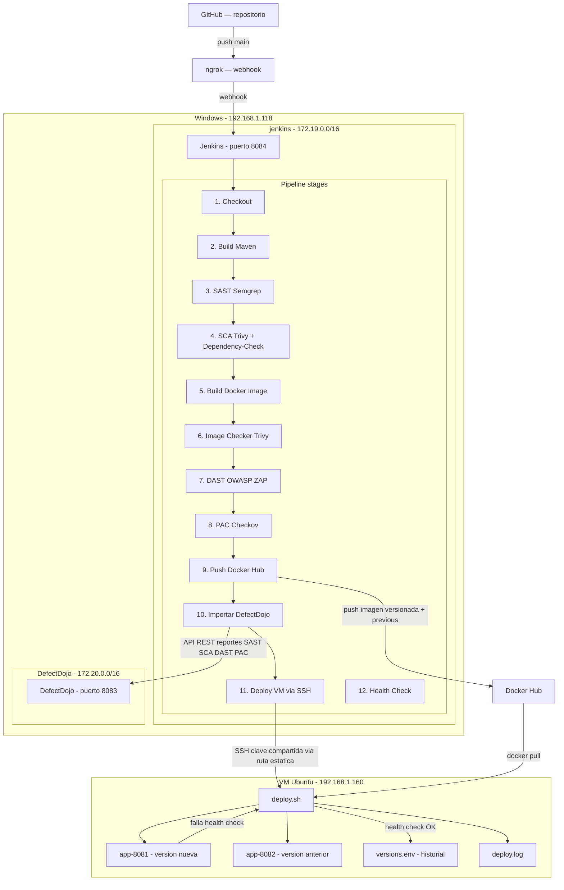

# Pipeline DevSecOps — Spring Boot

---

## Diagrama



---

## Flujo del pipeline

**Checkout** — Jenkins clona el repo `springboot-app` desde GitHub rama `main`.

**Build Maven** — compila el proyecto y genera el `.jar`. Se hace una sola vez y los demás stages usan ese artefacto.

**Generar versión** — crea un tag con timestamp `HHMM-DD-MM-YYYY`. Esa versión se usa en Docker y en el deploy.

**SAST + SCA en paralelo** — corren al mismo tiempo para ahorrar tiempo. Son dos análisis completamente independientes, uno no necesita el resultado del otro para empezar:

- Semgrep analiza el código fuente buscando vulnerabilidades estáticas
- Trivy escanea las dependencias del proyecto buscando CVEs
- Dependency-Check hace un segundo análisis de dependencias complementario

**Build Docker Image** — construye la imagen con la versión generada. Se hace después del análisis de código para no construir algo que ya sabemos que tiene problemas.

**Image Checker** — Trivy analiza la imagen Docker recién construida buscando misconfigurations en el Dockerfile y paquetes del sistema base.

**DAST** — levanta un contenedor temporal con la imagen, espera que arranque y ZAP la ataca en vivo buscando XSS, inyecciones, headers inseguros. Al terminar baja y elimina el contenedor temporal.

**PAC** — Checkov analiza los archivos de infraestructura como código buscando malas configuraciones de seguridad.

> En modo `IS_PRODUCTION=false` todos los stages corren sin cortar el pipeline aunque encuentren problemas. En modo `IS_PRODUCTION=true` cada stage tiene un gate que aborta si encuentra Critical, High o Medium.

**Push Docker Hub** — sube dos tags: la versión específica del build y `previous` con la versión anterior. Así el deploy siempre tiene ambas disponibles.

**Importar en DefectDojo** — envía los 5 reportes a DefectDojo via API REST por la red interna `modulo5diplomado`. Cada herramienta tiene su propio engagement configurado.

**Deploy en VM** — Jenkins lee la última versión del historial en la VM, pasa la versión nueva y la anterior al script como argumentos y lo ejecuta via SSH.

**Health Check** — Jenkins verifica desde su lado que los puertos 8081 y 8082 de la VM responden HTTP 200.

---

## deploy.sh — lo que pasa en la VM

El script recibe dos argumentos de Jenkins: la versión nueva y la anterior.

**Paso 1 — libera puertos.** Busca y mata cualquier contenedor que esté usando 8081 o 8082.

**Paso 2 — levanta dos contenedores:**

- `app-8081` con la versión nueva — la que acaba de construir el pipeline
- `app-8082` con la versión anterior — la última que funcionó bien

**Paso 3 — health check con reintentos.** Hace hasta 10 intentos con 10 segundos de espera entre cada uno golpeando `http://localhost:8081/health`. Espera HTTP 200.

**Paso 4a — si el health check pasa:** escribe la versión nueva en `versions.env`. Queda registrada como la nueva versión estable.

**Paso 4b — si el health check falla:** baja ambos contenedores, lee la última versión limpia de `versions.env` — la nueva nunca se escribió ahí — y levanta esa versión en 8081. El archivo no se toca. Jenkins recibe exit 1 y el pipeline marca fallo.

Todo queda registrado en `deploy.log` con timestamps.

---

## Explicación de comandos

---

### Símbolos que aparecen en todos lados

---

#### `2>/dev/null`

```bash
semgrep scan ... 2>/dev/null
```

Todo programa puede imprimir dos tipos de mensajes: los normales y los de error. El `2>` significa "redirige los mensajes de error hacia...". Y `/dev/null` es un agujero negro del sistema — todo lo que va ahí desaparece, no se guarda ni se muestra.

**Por qué se usa:** herramientas como Semgrep, Trivy y ZAP imprimen muchos warnings internos que no aportan nada. Sin esto el log de Jenkins se llenaría de ruido que distrae de lo importante.

---

#### `|| true`

```bash
semgrep scan ... || true
```

El `||` significa "o si falla, entonces...". En bash cuando un comando falla devuelve un código de error y Jenkins interpreta eso como que el stage falló y detiene el pipeline. `|| true` le dice: si el comando anterior falló no importa, considera que todo salió bien.

**Por qué se usa:** Semgrep, Trivy y ZAP devuelven código de error cuando encuentran vulnerabilidades — que es exactamente lo que queremos. Sin `|| true` Jenkins cortaría el pipeline en el primer hallazgo, antes de poder guardar el reporte y enviarlo a DefectDojo.

---

#### `${ }` — variables

```bash
--output ${REPORTS_DIR}/sast-semgrep.json
```

`${}` usa el valor de una variable. `REPORTS_DIR` está definido como `security-reports`. Entonces esto se convierte en `--output security-reports/sast-semgrep.json`. Es un placeholder que se reemplaza por el valor real cuando el comando corre.

---

#### `mkdir -p`

```bash
mkdir -p ${REPORTS_DIR}
```

Crea una carpeta. El `-p` hace que si la carpeta ya existe no dé error, y si la ruta tiene carpetas intermedias que tampoco existen las crea todas.

---

### Stage: SAST — Semgrep

```bash
semgrep scan \
    --config auto \
    --json \
    --output ${REPORTS_DIR}/sast-semgrep.json \
    ./src 2>/dev/null || true
```

El `\` al final de cada línea significa que el comando continúa en la siguiente. Es solo para legibilidad.

| Parte                                         | Qué hace                                                                                                             |
| --------------------------------------------- | -------------------------------------------------------------------------------------------------------------------- |
| `semgrep scan`                                | Ejecuta el análisis                                                                                                  |
| `--config auto`                               | Descarga y usa automáticamente las reglas recomendadas para el lenguaje que detecte — no hay que decirle que es Java |
| `--json`                                      | El reporte será en JSON, necesario para enviarlo a DefectDojo                                                        |
| `--output security-reports/sast-semgrep.json` | Guarda el reporte en ese archivo                                                                                     |
| `./src`                                       | Analiza solo la carpeta `src` donde vive el código fuente                                                            |

#### Contar hallazgos

```bash
FINDINGS=$(grep -c '"check_id"' ${REPORTS_DIR}/sast-semgrep.json 2>/dev/null || echo "0")
```

`$( )` ejecuta lo que está adentro y guarda el resultado en la variable. `grep -c` busca una palabra en un archivo y cuenta cuántas líneas la contienen. En el JSON de Semgrep cada vulnerabilidad tiene un campo `"check_id"` — contar esas líneas es contar cuántas vulnerabilidades encontró. `|| echo "0"` devuelve cero si el archivo no existe.

#### Gate de producción

```bash
CRITICAL=$(grep -c '"severity":"ERROR"'   ${REPORTS_DIR}/sast-semgrep.json 2>/dev/null || echo "0")
HIGH=$(grep -c '"severity":"WARNING"' ${REPORTS_DIR}/sast-semgrep.json 2>/dev/null || echo "0")
if [ "${CRITICAL}" -gt 0 ] || [ "${HIGH}" -gt 0 ]; then
    echo "PROD: SAST encontro hallazgos criticos. Abortando."
    exit 1
fi
```

Semgrep guarda la severidad como `"severity":"ERROR"` para críticos y `"severity":"WARNING"` para altos. El `if` evalúa: si CRITICAL es mayor que 0 (`-gt` = greater than) o HIGH es mayor que 0, ejecuta `exit 1`. En bash `exit 1` termina con error — Jenkins ve eso y marca el pipeline como fallido. Este bloque solo corre si `IS_PRODUCTION=true`.

---

### Stage: SCA — Trivy + Dependency-Check

```bash
trivy fs \
    --format json \
    --output ${REPORTS_DIR}/sca-trivy.json \
    --scanners vuln \
    . 2>/dev/null || true
```

| Parte             | Qué hace                                                                           |
| ----------------- | ---------------------------------------------------------------------------------- |
| `trivy fs`        | `fs` = filesystem, escanea archivos del proyecto buscando dependencias vulnerables |
| `--scanners vuln` | Solo busca CVEs, no secrets ni misconfigs — eso es para otro stage                 |
| `.`               | El punto significa la carpeta actual                                               |

```bash
dependency-check \
    --project "${DD_PRODUCT}" \
    --scan . \
    --format JSON \
    --out ${REPORTS_DIR} \
    --disableAssembly \
    --noupdate 2>/dev/null || true
```

| Parte               | Qué hace                                                                                                                                                      |
| ------------------- | ------------------------------------------------------------------------------------------------------------------------------------------------------------- |
| `--disableAssembly` | No intenta analizar archivos .NET — el proyecto es Java, esto evita errores                                                                                   |
| `--noupdate`        | No descarga actualizaciones de la base de datos de CVEs durante el análisis. La base ya está descargada previamente — sin esto ralentizaría mucho el pipeline |

---

### Stage: Build Docker Image

```bash
docker build -t ${DOCKER_HUB_USER}/${IMAGE_NAME}:${env.IMAGE_VERSION} .
```

| Parte                                              | Qué hace                                                |
| -------------------------------------------------- | ------------------------------------------------------- |
| `docker build`                                     | Construye una imagen leyendo el Dockerfile del proyecto |
| `-t`                                               | Tag — le da nombre a la imagen                          |
| `crayolito/proyecto-final-modulo5:0640-16-03-2026` | usuario/nombre:versión                                  |
| `.`                                                | Usa el Dockerfile de la carpeta actual                  |

---

### Stage: Image Checker — Trivy

```bash
trivy config \
    --format json \
    --output ${REPORTS_DIR}/image-checker.json \
    . 2>/dev/null || true
```

`trivy config` es diferente a `trivy fs`. En lugar de buscar CVEs en dependencias analiza los archivos de configuración de infraestructura — Dockerfile, docker-compose — buscando malas configuraciones. Por ejemplo: contenedor corriendo como root, variables de entorno con contraseñas hardcodeadas.

```bash
if [ ! -f "${REPORTS_DIR}/image-checker.json" ]; then
    echo '{"Results":[]}' > ${REPORTS_DIR}/image-checker.json
fi
```

`-f` verifica si un archivo existe. El `!` lo niega — si el archivo NO existe. Si Trivy no generó el archivo se crea uno vacío válido en JSON para que el stage de DefectDojo no falle al intentar enviarlo.

---

### Stage: DAST — OWASP ZAP

```bash
docker run -d \
    --name app-dast-temp \
    -p 8089:8080 \
    ${DOCKER_HUB_USER}/${IMAGE_NAME}:${env.IMAGE_VERSION}
```

| Parte                  | Qué hace                                                                                                   |
| ---------------------- | ---------------------------------------------------------------------------------------------------------- |
| `-d`                   | Detached — corre en segundo plano sin bloquear el terminal                                                 |
| `--name app-dast-temp` | Nombre para poder referenciarlo después                                                                    |
| `-p 8089:8080`         | Expone el puerto 8080 del contenedor como 8089 en el host — se usa 8089 para no chocar con otros servicios |

```bash
sleep 25
```

Espera 25 segundos. Spring Boot tarda en inicializar — si ZAP ataca antes de que la app esté lista no encontraría nada porque no hay nada respondiendo.

```bash
zap.sh -cmd \
    -port 8090 \
    -quickurl http://172.17.0.1:8089 \
    -quickprogress \
    -quickout $(pwd)/${REPORTS_DIR}/dast-zap.xml 2>/dev/null || true
```

| Parte                              | Qué hace                                                                                                                                              |
| ---------------------------------- | ----------------------------------------------------------------------------------------------------------------------------------------------------- |
| `-cmd`                             | Corre ZAP sin interfaz gráfica                                                                                                                        |
| `-port 8090`                       | Puerto donde ZAP levanta su proxy interno                                                                                                             |
| `-quickurl http://172.17.0.1:8089` | URL a atacar. `172.17.0.1` es el gateway de la red Docker — desde dentro del contenedor Jenkins es la forma de llegar al host y de ahí al puerto 8089 |
| `$(pwd)`                           | Devuelve la ruta de la carpeta actual para construir la ruta completa del archivo de salida                                                           |

```bash
docker stop app-dast-temp || true
docker rm   app-dast-temp || true
```

Apaga y elimina el contenedor temporal. `|| true` porque si ya no existe no queremos que falle el stage.

---

### Stage: PAC — Checkov

```bash
${CHECKOV_BIN} \
    --directory . \
    --output json \
    --skip-download \
    --quiet > ${REPORTS_DIR}/pac-checkov.json 2>/dev/null || true
```

| Parte             | Qué hace                                                                                              |
| ----------------- | ----------------------------------------------------------------------------------------------------- |
| `${CHECKOV_BIN}`  | Ruta completa al binario — se usa porque Checkov se instaló en una ubicación no estándar              |
| `--skip-download` | No descarga reglas actualizadas durante el análisis                                                   |
| `--quiet`         | Solo imprime el resultado, sin mensajes de progreso                                                   |
| `>`               | Redirige la salida normal al archivo. Diferente al `2>` — este redirige mensajes normales, no errores |

---

### Stage: Push Docker Hub

```bash
echo ${DOCKER_TOKEN} | docker login -u ${DOCKER_USER} --password-stdin
```

`echo` imprime el token. El `|` (pipe) toma esa salida y la pasa como entrada al siguiente comando. `--password-stdin` lee la contraseña desde ahí en lugar de pedirla interactivamente — evita que aparezca en los logs.

```bash
retry(3) {
    sh "docker push ..."
}
```

`retry(3)` es de Jenkins — intenta el bloque hasta 3 veces si falla. Un push puede fallar por problemas de red momentáneos y con esto se reintenta automáticamente.

```bash
docker tag ${IMAGE}:${VERSION} ${IMAGE}:previous
```

Crea un alias de la imagen con el tag `previous`. Así en Docker Hub siempre hay un tag `previous` apuntando a la versión anterior — lo que el deploy.sh usa para levantar el contenedor de respaldo en 8082.

---

### Stage: Importar en DefectDojo

```bash
import_scan() {
    local scan_type=$1
    local file=$2
    local engagement=$3
}
```

Define una función reutilizable. `local` declara variables que solo existen dentro de la función. `$1`, `$2`, `$3` son los argumentos que se le pasan — el primero, segundo y tercero.

```bash
RESPONSE=$(curl -s -X POST \
    -H "Authorization: Token ${DD_TOKEN}" \
    -F "file=@${file}" \
    "${DD_URL}/api/v2/import-scan/")
```

| Parte                           | Qué hace                                                                         |
| ------------------------------- | -------------------------------------------------------------------------------- |
| `curl`                          | Herramienta para hacer peticiones HTTP desde la línea de comandos                |
| `-s`                            | Silent — no muestra barra de progreso                                            |
| `-X POST`                       | Tipo de petición HTTP para enviar datos                                          |
| `-H "Authorization: Token ..."` | Header de autenticación para que DefectDojo acepte la petición                   |
| `-F "file=@${file}"`            | El `@` adjunta el archivo — como cuando adjuntas un archivo en un formulario web |

```bash
if echo "${RESPONSE}" | grep -q '"test":'; then
```

DefectDojo responde con JSON que contiene `"test":` cuando la importación fue exitosa. `grep -q` busca silenciosamente — solo devuelve si encontró o no.

---

### Stage: Deploy en VM

```bash
def versionAnterior = sh(
    script: "ssh ${VM_USER}@${VM_HOST} 'tail -1 ${VERSIONS_FILE} 2>/dev/null || echo \"${versionNueva}\"'",
    returnStdout: true
).trim()
```

`ssh usuario@host 'comando'` ejecuta un comando en la máquina remota sin entrar interactivamente. `tail -1` lee solo la última línea del archivo — la versión más reciente registrada. `.trim()` elimina espacios y saltos de línea del resultado.

---

### deploy.sh — comandos clave

#### Función log

```bash
log() {
    echo "$1"
    echo "$1" >> "${LOG_FILE}"
}
```

Imprime en pantalla y agrega al archivo de log al mismo tiempo. `>>` agrega al final sin borrar lo anterior. Si fuera `>` borraría el contenido cada vez.

#### Liberar puertos

```bash
CONT_8081=$(docker ps --filter "publish=8081" --format "{{.ID}}" 2>/dev/null)
if [ -n "${CONT_8081}" ]; then
    docker stop ${CONT_8081} > /dev/null
    docker rm   ${CONT_8081} > /dev/null
fi
```

`--filter "publish=8081"` lista solo contenedores con ese puerto expuesto. `--format "{{.ID}}"` devuelve solo el ID sin columnas extra. `[ -n ]` verifica que la variable no esté vacía — si no hay contenedor en ese puerto no entra al if.

#### Health check con reintentos

```bash
while [ ${INTENTO} -lt ${MAX_INTENTOS} ]; do
    INTENTO=$((INTENTO + 1))
    STATUS=$(curl -s -o /dev/null -w "%{http_code}" --max-time 5 http://localhost:8081/health || echo "000")
    if [ "${STATUS}" = "200" ]; then
        SALIO_OK=1
        break
    fi
    sleep ${SEGUNDOS_ESPERA}
done
```

`while [ condición ]; do ... done` repite mientras la condición sea verdadera. `-lt` = less than, menor que. `$((INTENTO + 1))` es aritmética en bash.

`curl -s -o /dev/null -w "%{http_code}"` pide solo el código HTTP de la respuesta: `-o /dev/null` descarta el cuerpo, `-w "%{http_code}"` imprime solo el código — 200, 404, 500. `--max-time 5` espera máximo 5 segundos.

Si el código es `200` pone `SALIO_OK=1` y `break` sale del bucle inmediatamente. Si no, espera y vuelve a intentar.

#### Rollback

```bash
VERSION_ROLLBACK=$(tail -1 "${VERSIONS_FILE}")
docker run -d --name app-8081 -p 8081:8080 ${VERSION_ROLLBACK} > /dev/null
exit 1
```

`tail -1` lee la última versión del historial — siempre es algo que funcionó porque la versión nueva nunca se escribe si el health check falla. `exit 1` le avisa a Jenkins que el deploy falló y el pipeline se marca como fallido.

---

### post — lo que siempre corre al final

```groovy
post {
    always {
        sh "docker rmi ${IMAGE}:${VERSION} || true"
        archiveArtifacts artifacts: "${REPORTS_DIR}/**", allowEmptyArchive: true
        sh 'docker stop app-dast-temp 2>/dev/null || true'
        sh 'docker rm   app-dast-temp 2>/dev/null || true'
    }
}
```

`docker rmi` elimina la imagen local — ya está en Docker Hub, no necesita quedarse ocupando disco. `archiveArtifacts` guarda los reportes de seguridad en Jenkins para revisarlos desde la interfaz web. `${REPORTS_DIR}/**` — el `**` significa todos los archivos dentro de esa carpeta y subcarpetas. `allowEmptyArchive: true` — si no hay reportes no falla. El contenedor `app-dast-temp` se limpia también aquí por si el stage DAST falló a mitad y lo dejó corriendo.

---

### Paralelo — por qué SAST y SCA corren al mismo tiempo

```groovy
stage('SAST + SCA') {
    parallel {
        stage('SAST - Semgrep') { ... }
        stage('SCA - Trivy + Dependency-Check') { ... }
    }
}
```

SAST analiza código fuente y SCA analiza dependencias. Son completamente independientes — uno no necesita el resultado del otro para empezar. En lugar de esperar que termine uno para iniciar el otro, Jenkins los corre al mismo tiempo. Si cada uno tarda 3 minutos, en paralelo terminan en 3 minutos en lugar de 6.
