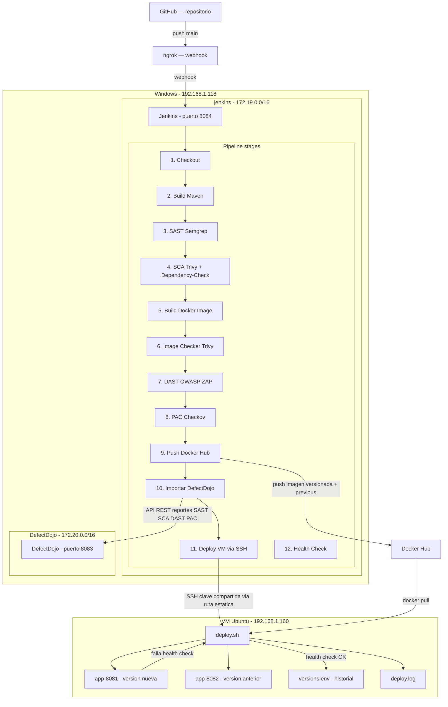

# Pipeline DevSecOps — Spring Boot

---

## Diagrama



---

## Flujo del pipeline

**Checkout** — Jenkins clona el repo `springboot-app` desde GitHub rama `main`.

**Build Maven** — compila el proyecto y genera el `.jar`. Se hace una sola vez y los demás stages usan ese artefacto.

**Generar versión** — crea un tag con timestamp `HHMM-DD-MM-YYYY`. Esa versión se usa en Docker y en el deploy.

**SAST + SCA en paralelo** — corren al mismo tiempo para ahorrar tiempo. Son dos análisis completamente independientes, uno no necesita el resultado del otro para empezar:

- Semgrep analiza el código fuente buscando vulnerabilidades estáticas
- Trivy escanea las dependencias del proyecto buscando CVEs
- Dependency-Check hace un segundo análisis de dependencias complementario

**Build Docker Image** — construye la imagen con la versión generada. Se hace después del análisis de código para no construir algo que ya sabemos que tiene problemas.

**Image Checker** — Trivy analiza la imagen Docker recién construida buscando misconfigurations en el Dockerfile y paquetes del sistema base.

**DAST** — levanta un contenedor temporal con la imagen, espera que arranque y ZAP la ataca en vivo buscando XSS, inyecciones, headers inseguros. Al terminar baja y elimina el contenedor temporal.

**PAC** — Checkov analiza los archivos de infraestructura como código buscando malas configuraciones de seguridad.

> En modo `IS_PRODUCTION=false` todos los stages corren sin cortar el pipeline aunque encuentren problemas. En modo `IS_PRODUCTION=true` cada stage tiene un gate que aborta si encuentra Critical, High o Medium.

**Push Docker Hub** — sube dos tags: la versión específica del build y `previous` con la versión anterior. Así el deploy siempre tiene ambas disponibles.

**Importar en DefectDojo** — envía los 5 reportes a DefectDojo via API REST por la red interna `modulo5diplomado`. Cada herramienta tiene su propio engagement configurado.

**Deploy en VM** — Jenkins lee la última versión del historial en la VM, pasa la versión nueva y la anterior al script como argumentos y lo ejecuta via SSH.

**Health Check** — Jenkins verifica desde su lado que los puertos 8081 y 8082 de la VM responden HTTP 200.

---

## deploy.sh — lo que pasa en la VM

El script recibe dos argumentos de Jenkins: la versión nueva y la anterior.

**Paso 1 — libera puertos.** Busca y mata cualquier contenedor que esté usando 8081 o 8082.

**Paso 2 — levanta dos contenedores:**

- `app-8081` con la versión nueva — la que acaba de construir el pipeline
- `app-8082` con la versión anterior — la última que funcionó bien

**Paso 3 — health check con reintentos.** Hace hasta 10 intentos con 10 segundos de espera entre cada uno golpeando `http://localhost:8081/health`. Espera HTTP 200.

**Paso 4a — si el health check pasa:** escribe la versión nueva en `versions.env`. Queda registrada como la nueva versión estable.

**Paso 4b — si el health check falla:** baja ambos contenedores, lee la última versión limpia de `versions.env` — la nueva nunca se escribió ahí — y levanta esa versión en 8081. El archivo no se toca. Jenkins recibe exit 1 y el pipeline marca fallo.

Todo queda registrado en `deploy.log` con timestamps.

---

## Explicación de comandos

---

### Símbolos y patrones que aparecen en todo el pipeline

---

#### `2>/dev/null`

```bash
semgrep scan ... 2>/dev/null
```

En bash todo proceso tiene tres canales de comunicación numerados: `0` es la entrada, `1` es la salida normal, `2` es la salida de errores. El `>` es el operador de redirección — indica hacia dónde va algo. Entonces `2>` significa "redirige el canal de errores hacia...". Y `/dev/null` es un archivo especial del sistema operativo que descarta todo lo que recibe — no lo guarda en disco ni lo muestra, simplemente desaparece.

El resultado es que cualquier mensaje de error que imprima el comando queda completamente silenciado. Herramientas como Semgrep, Trivy y ZAP imprimen advertencias internas sobre versiones, configuraciones o conexiones que no tienen nada que ver con los hallazgos de seguridad. Sin este silenciador, el log de Jenkins se llenaría de esos mensajes y sería difícil ver lo que importa.

---

#### `|| true`

```bash
semgrep scan ... || true
```

En bash cada comando al terminar devuelve un número llamado código de salida. `0` significa éxito, cualquier otro número significa fallo. El operador `||` evalúa ese código — si el comando de la izquierda devolvió fallo, ejecuta lo que está a la derecha. `true` es un comando que siempre devuelve `0` (éxito) sin hacer nada más.

El problema que resuelve es el siguiente: Semgrep, Trivy y ZAP están diseñados para que cuando encuentran vulnerabilidades devuelvan código de error, porque desde su perspectiva "encontré problemas" es un resultado negativo. Jenkins interpreta ese código de error como que el stage falló y detiene el pipeline. Pero nosotros necesitamos que el pipeline continúe aunque encuentre hallazgos, porque aún falta guardar el reporte y enviarlo a DefectDojo. `|| true` hace que Jenkins siempre vea código `0` sin importar lo que encontró la herramienta.

---

#### `${ }` — variables de entorno

```bash
--output ${REPORTS_DIR}/sast-semgrep.json
```

`${}` es la sintaxis de bash para leer el valor de una variable. Cuando el shell encuentra `${REPORTS_DIR}` lo reemplaza por su valor antes de ejecutar el comando. `REPORTS_DIR` está declarado en el bloque `environment { }` del pipeline con el valor `security-reports`, entonces esta línea se convierte en `--output security-reports/sast-semgrep.json` en tiempo de ejecución.

Usar variables en lugar de escribir las rutas directamente tiene una ventaja concreta: si se cambia la carpeta de reportes, se actualiza en un solo lugar en el pipeline y el cambio aplica a todos los comandos automáticamente.

---

#### `\` — continuación de línea

```bash
semgrep scan \
    --config auto \
    --json \
    ./src
```

El `\` al final de una línea le dice al shell que el comando no terminó ahí, que continúa en la siguiente línea. Para el shell es exactamente lo mismo que escribir todo en una sola línea. Se usa únicamente para que el código sea más fácil de leer — sin esto, un comando con diez flags quedaría en una sola línea horizontal muy larga.

---

#### `mkdir -p`

```bash
mkdir -p ${REPORTS_DIR}
```

`mkdir` crea una carpeta. Sin ningún flag, falla con error si la carpeta ya existe o si alguna carpeta del camino no existe. El flag `-p` resuelve ambos casos: si la carpeta ya existe no hace nada ni lanza error, y si la ruta incluye carpetas intermedias que tampoco existen las crea todas en cadena. En el pipeline se llama al inicio de cada stage para garantizar que la carpeta de reportes existe antes de intentar escribir archivos ahí.

---

### Stage: SAST — Semgrep

```bash
semgrep scan \
    --config auto \
    --json \
    --output ${REPORTS_DIR}/sast-semgrep.json \
    ./src 2>/dev/null || true
```

**`semgrep scan`** — invoca Semgrep en modo análisis. Semgrep es una herramienta de análisis estático que lee el código fuente como texto y busca patrones que coincidan con reglas de seguridad, sin ejecutar el código.

**`--config auto`** — en lugar de apuntar a un archivo de reglas específico, Semgrep detecta el lenguaje del proyecto y descarga automáticamente el conjunto de reglas recomendadas para ese lenguaje desde el registro público de Semgrep. Para un proyecto Java descarga reglas específicas de Java.

**`--json`** — por defecto Semgrep imprime los hallazgos en texto legible para humanos. Este flag cambia la salida a formato JSON estructurado, que es el formato que DefectDojo puede parsear e importar.

**`--output ${REPORTS_DIR}/sast-semgrep.json`** — sin este flag el JSON se imprime en pantalla. Este flag redirige esa salida a un archivo en disco para poder enviarlo a DefectDojo después.

**`./src`** — le indica a Semgrep qué carpeta analizar. Se limita a `src` porque ahí está el código fuente Java. Sin esta restricción analizaría también carpetas como `target` (compilados), `.git` o configuraciones que no son código del proyecto y generaría ruido.

---

#### Contar hallazgos

```bash
FINDINGS=$(grep -c '"check_id"' ${REPORTS_DIR}/sast-semgrep.json 2>/dev/null || echo "0")
```

**`$( )`** — es sustitución de comandos. El shell ejecuta lo que está adentro y el resultado reemplaza toda la expresión. En este caso el resultado (un número) queda guardado en `FINDINGS`.

**`grep -c '"check_id"'`** — `grep` busca texto dentro de archivos. El flag `-c` cambia su comportamiento: en vez de imprimir las líneas que contienen el patrón, imprime solo el conteo. `"check_id"` es el campo que Semgrep pone en el JSON por cada vulnerabilidad encontrada — una línea con ese campo equivale a un hallazgo.

**`2>/dev/null`** — si el archivo JSON no existe porque Semgrep falló antes de crearlo, `grep` imprimiría un error como `No such file or directory`. Ese error se silencia para que no aparezca en los logs.

**`|| echo "0"`** — si el archivo no existe, `grep` falla y este fallback imprime el texto `"0"`, que queda guardado en `FINDINGS`. Así la variable siempre tiene un valor numérico válido.

---

#### Gate de producción

```bash
CRITICAL=$(grep -c '"severity":"ERROR"'   ${REPORTS_DIR}/sast-semgrep.json 2>/dev/null || echo "0")
HIGH=$(grep -c '"severity":"WARNING"' ${REPORTS_DIR}/sast-semgrep.json 2>/dev/null || echo "0")
if [ "${CRITICAL}" -gt 0 ] || [ "${HIGH}" -gt 0 ]; then
    echo "PROD: SAST encontro hallazgos criticos. Abortando."
    exit 1
fi
```

**`grep -c '"severity":"ERROR"'`** — Semgrep escribe la severidad de cada hallazgo en el JSON. Usa `"ERROR"` para los críticos y `"WARNING"` para los altos. Contar las líneas con ese patrón da el número de hallazgos de esa severidad.

**`[ "${CRITICAL}" -gt 0 ]`** — los corchetes son la sintaxis de bash para evaluaciones condicionales. `-gt` significa _greater than_ (mayor que). La comparación necesita comillas alrededor de la variable por si estuviera vacía — sin comillas bash lanzaría un error de sintaxis.

**`||`** — dentro del `if` este operador funciona como "o". La condición es verdadera si CRITICAL es mayor que cero **o** si HIGH es mayor que cero — cualquiera de los dos es suficiente para abortar.

**`exit 1`** — termina el script con código de error. Jenkins recibe ese código, marca el stage como fallido y detiene el pipeline. Este bloque solo corre cuando `IS_PRODUCTION=true` — en modo QA el pipeline siempre continúa.

---

### Stage: SCA — Trivy + Dependency-Check

```bash
trivy fs \
    --format json \
    --output ${REPORTS_DIR}/sca-trivy.json \
    --scanners vuln \
    . 2>/dev/null || true
```

**`trivy fs`** — `fs` es el subcomando _filesystem_. Trivy recorre los archivos del proyecto buscando manifiestos de dependencias (`pom.xml` para Maven, `package.json` para Node, etc.), extrae la lista de librerías y versiones, y las compara contra su base de datos de CVEs.

**`--format json`** — igual que en Semgrep, cambia la salida a JSON para que DefectDojo pueda importarlo.

**`--output ${REPORTS_DIR}/sca-trivy.json`** — guarda el reporte en archivo en lugar de imprimirlo en pantalla.

**`--scanners vuln`** — Trivy puede buscar varias cosas a la vez: vulnerabilidades en dependencias, secretos hardcodeados, y misconfigurations. Este flag limita el análisis solo a vulnerabilidades (`vuln`). Los secretos y misconfigurations los analiza otro stage para mantener los reportes separados por tipo.

**`.`** — el punto es la carpeta actual, la raíz del repositorio donde están el `pom.xml` y el código.

---

```bash
dependency-check \
    --project "${DD_PRODUCT}" \
    --scan . \
    --format JSON \
    --out ${REPORTS_DIR} \
    --disableAssembly \
    --noupdate 2>/dev/null || true
```

**`--project "${DD_PRODUCT}"`** — nombre del proyecto que aparece en el reporte. `DD_PRODUCT` tiene el valor `springboot-app`. Las comillas dobles son necesarias porque si el nombre tuviera espacios, sin comillas bash lo partiría en varios argumentos.

**`--scan .`** — carpeta a analizar, igual que el `.` de Trivy.

**`--format JSON`** — formato de salida del reporte.

**`--out ${REPORTS_DIR}`** — a diferencia de Trivy que pide la ruta completa del archivo, Dependency-Check recibe solo la carpeta y él mismo decide el nombre del archivo (`dependency-check-report.json`).

**`--disableAssembly`** — Dependency-Check tiene capacidad de analizar archivos compilados `.NET` (ensamblados). Como el proyecto es Java esa capacidad no sirve y además requiere tener instalado Mono en el sistema. Sin este flag lanzaría errores buscando una herramienta que no existe.

**`--noupdate`** — antes de analizar, Dependency-Check normalmente descarga actualizaciones de la base de datos NVD (National Vulnerability Database). Esa descarga puede tardar varios minutos. Como la base ya se descargó previamente en la instalación, este flag la omite para que el pipeline no sea lento en cada ejecución.

---

### Stage: Build Docker Image

```bash
docker build -t ${DOCKER_HUB_USER}/${IMAGE_NAME}:${env.IMAGE_VERSION} .
```

**`docker build`** — lee el `Dockerfile` del proyecto y construye una imagen siguiendo sus instrucciones: descarga la imagen base, copia el `.jar`, configura el comando de arranque, etc.

**`-t`** — _tag_, le asigna un nombre a la imagen resultante. Sin este flag la imagen se crea pero sin nombre, lo que hace imposible referenciarla después.

**`${DOCKER_HUB_USER}/${IMAGE_NAME}:${env.IMAGE_VERSION}`** — el nombre sigue el formato `usuario/repositorio:tag` que Docker Hub espera. `env.IMAGE_VERSION` tiene el timestamp generado en el stage anterior, por ejemplo `0640-16-03-2026`. El resultado completo sería algo como `crayolito/proyecto-final-modulo5:0640-16-03-2026`.

**`.`** — le dice a Docker dónde encontrar el `Dockerfile` y los archivos que necesita copiar. El punto significa la carpeta actual.

---

### Stage: Image Checker — Trivy

```bash
trivy config \
    --format json \
    --output ${REPORTS_DIR}/image-checker.json \
    . 2>/dev/null || true
```

**`trivy config`** — subcomando diferente a `trivy fs`. En lugar de buscar CVEs en dependencias de código, analiza archivos de infraestructura como código buscando configuraciones inseguras. Revisa el `Dockerfile` buscando problemas como: imagen base sin versión fija (`FROM ubuntu` en vez de `FROM ubuntu:22.04`), contenedor que corre como root, puertos innecesarios expuestos, variables de entorno con contraseñas escritas directamente.

**`--format json`** y **`--output`** — misma función que en los stages anteriores.

**`.`** — analiza todos los archivos de configuración de la carpeta actual.

---

```bash
if [ ! -f "${REPORTS_DIR}/image-checker.json" ]; then
    echo '{"Results":[]}' > ${REPORTS_DIR}/image-checker.json
fi
```

**`[ -f "archivo" ]`** — evaluación que devuelve verdadero si el archivo existe y es un archivo regular (no una carpeta ni un link).

**`!`** — niega la evaluación. La condición completa `[ ! -f "..." ]` es verdadera cuando el archivo **no** existe.

**`echo '{"Results":[]}'`** — imprime ese texto. Las comillas simples son importantes aquí porque evitan que bash intente interpretar los caracteres especiales del JSON como sintaxis propia.

**`>`** — redirige esa salida al archivo. Si el archivo no existe lo crea. Si existiera lo sobreescribiría. El resultado es un JSON mínimo válido que DefectDojo puede leer sin errores aunque esté vacío.

---

### Stage: DAST — OWASP ZAP

```bash
docker run -d \
    --name app-dast-temp \
    -p 8089:8080 \
    ${DOCKER_HUB_USER}/${IMAGE_NAME}:${env.IMAGE_VERSION}
```

**`docker run`** — descarga la imagen si no está en local y arranca un contenedor nuevo a partir de ella.

**`-d`** — _detached mode_. Sin este flag el comando bloquearía la terminal mostrando los logs del contenedor hasta que se apague. Con `-d` el contenedor arranca en segundo plano y el comando devuelve el control inmediatamente para que el pipeline continúe.

**`--name app-dast-temp`** — le asigna un nombre fijo al contenedor. Docker genera un nombre aleatorio si no se especifica. El nombre fijo es necesario para poder referenciarlo después con `docker stop app-dast-temp` sin tener que buscar su ID.

**`-p 8089:8080`** — mapeo de puertos en formato `host:contenedor`. La app dentro del contenedor escucha en el puerto `8080` (el que configura Spring Boot por defecto). El `8089` es el puerto por el que se puede acceder desde fuera del contenedor. Se elige `8089` para no colisionar con otros servicios que ya usan otros puertos en el host.

---

```bash
sleep 25
```

Pausa la ejecución del pipeline durante 25 segundos. Spring Boot necesita tiempo para arrancar: carga el contexto de Spring, inicializa los beans, abre la conexión a la base de datos, y finalmente empieza a aceptar peticiones. Si ZAP intenta atacar antes de que ese proceso termine, encontraría conexiones rechazadas y el escaneo no serviría.

---

```bash
zap.sh -cmd \
    -port 8090 \
    -quickurl http://172.17.0.1:8089 \
    -quickprogress \
    -quickout $(pwd)/${REPORTS_DIR}/dast-zap.xml 2>/dev/null || true
```

**`zap.sh`** — script de arranque de OWASP ZAP. ZAP es una herramienta de ataque activo que simula lo que haría un atacante real: manda peticiones maliciosas probando XSS, inyecciones SQL, headers inseguros, métodos HTTP no permitidos, entre otros.

**`-cmd`** — corre ZAP completamente en modo línea de comandos, sin levantar la interfaz gráfica. Necesario porque el agente Jenkins no tiene pantalla.

**`-port 8090`** — ZAP funciona como proxy interceptor. Este es el puerto donde ZAP levanta su propio servidor interno para gestionar el tráfico del escaneo. Se usa `8090` porque `8080` y `8089` ya están ocupados.

**`-quickurl http://172.17.0.1:8089`** — la URL que ZAP va a atacar. `172.17.0.1` no es la IP de ningún servidor externo — es el gateway de la red bridge por defecto de Docker. Desde dentro de un contenedor (donde corre Jenkins), esa dirección apunta al host físico Windows. Entonces la ruta completa es: contenedor Jenkins → gateway Docker `172.17.0.1` → host Windows → puerto `8089` → contenedor de la app.

**`-quickprogress`** — imprime en la terminal el estado del escaneo mientras avanza, en lugar de correr en completo silencio.

**`-quickout $(pwd)/${REPORTS_DIR}/dast-zap.xml`** — guarda el reporte en XML. `$(pwd)` ejecuta el comando `pwd` (_print working directory_) y lo reemplaza por la ruta absoluta de la carpeta actual. ZAP requiere ruta absoluta para el archivo de salida — una ruta relativa como `security-reports/dast-zap.xml` puede fallar dependiendo desde dónde ZAP resuelve la ruta.

---

```bash
docker stop app-dast-temp || true
docker rm   app-dast-temp || true
```

**`docker stop`** — envía la señal `SIGTERM` al proceso principal del contenedor para que se cierre limpiamente. Si no responde en 10 segundos, Docker lo fuerza.

**`docker rm`** — elimina el contenedor del sistema. `stop` solo lo detiene pero el contenedor sigue existiendo en disco. `rm` lo borra completamente. Si no se hiciera esto, el próximo build fallaría al intentar crear un contenedor con el mismo nombre `app-dast-temp` porque Docker no permite dos contenedores con el mismo nombre.

El `|| true` en ambos evita que el stage falle si el contenedor ya no existe — por ejemplo si el stage DAST falló antes de crearlo.

---

### Stage: PAC — Checkov

```bash
${CHECKOV_BIN} \
    --directory . \
    --output json \
    --skip-download \
    --quiet > ${REPORTS_DIR}/pac-checkov.json 2>/dev/null || true
```

**`${CHECKOV_BIN}`** — en lugar de llamar a `checkov` directamente, se usa la ruta completa `/var/jenkins_home/.local/bin/checkov`. Cuando un usuario instala una herramienta Python con `pip install --user`, se instala en `~/.local/bin` que no está en el `PATH` del proceso Jenkins. Sin la ruta explícita el shell diría `command not found`.

**`--directory .`** — carpeta que Checkov va a analizar. Revisa todos los archivos reconocibles como infraestructura como código: `Dockerfile`, `docker-compose.yml`, archivos Terraform, Kubernetes YAML, etc.

**`--output json`** — formato del reporte para poder importarlo en DefectDojo.

**`--skip-download`** — Checkov puede descargar definiciones de políticas actualizadas desde internet. Este flag lo omite para que el análisis use solo las reglas ya instaladas y no dependa de conectividad externa durante el pipeline.

**`--quiet`** — suprime los mensajes de progreso. Sin este flag Checkov imprime una barra de progreso y mensajes informativos además del JSON del reporte, lo que rompe el JSON al redirigirlo al archivo.

**`>`** — redirige la salida estándar (canal `1`) al archivo. Distinto a `2>` que redirige errores. Checkov escribe el JSON del reporte por la salida estándar, entonces este operador es el que captura el reporte en disco.

---

### Stage: Push Docker Hub

```bash
echo ${DOCKER_TOKEN} | docker login -u ${DOCKER_USER} --password-stdin
```

**`echo ${DOCKER_TOKEN}`** — imprime el valor del token en la salida estándar.

**`|`** — _pipe_. Conecta la salida estándar del comando de la izquierda con la entrada estándar del comando de la derecha. El token que `echo` imprime pasa directamente como entrada a `docker login`.

**`docker login -u ${DOCKER_USER}`** — inicia sesión en Docker Hub con ese usuario.

**`--password-stdin`** — le dice a Docker que lea la contraseña desde la entrada estándar en lugar de pedirla interactivamente o recibirla como argumento. Si la contraseña fuera un argumento (`docker login -p mitoken`) quedaría visible en el historial de comandos y en los logs de Jenkins. Leerla desde stdin la mantiene fuera de los logs.

---

```bash
retry(3) {
    sh "docker push ..."
}
```

**`retry(3)`** — función de Jenkins (no de bash). Ejecuta el bloque hasta 3 veces si el intento anterior termina en error. Un push a Docker Hub puede fallar por timeouts de red, rate limits temporales o inestabilidad del registro. Sin reintentos un fallo transitorio requeriría relanzar todo el pipeline manualmente.

---

```bash
docker tag ${IMAGE}:${VERSION} ${IMAGE}:previous
```

**`docker tag`** — crea un nuevo nombre (tag) para una imagen que ya existe localmente. No copia ni duplica la imagen — ambos tags apuntan a los mismos datos. El nuevo tag `previous` representa "la versión anterior a la próxima". Cuando el próximo build corra, esta imagen será la versión anterior que `deploy.sh` levantará en el puerto 8082 como respaldo.

---

### Stage: Importar en DefectDojo

```bash
import_scan() {
    local scan_type=$1
    local file=$2
    local engagement=$3
}
```

**`import_scan()`** — declara una función en bash. Todo lo que está entre `{ }` es el cuerpo que se ejecuta cuando se llama la función. Sin esta función habría que copiar y pegar el bloque completo de `curl` cinco veces, una por cada reporte.

**`local`** — declara una variable cuyo alcance es solo dentro de la función. Sin `local`, las variables quedarían definidas en el contexto global del script y podrían sobreescribir accidentalmente otras variables con el mismo nombre.

**`$1`, `$2`, `$3`** — variables especiales de bash que contienen los argumentos posicionales. Cuando se llama `import_scan "Semgrep JSON Report" "archivo.json" "sast-semgrep"`, dentro de la función `$1` vale `"Semgrep JSON Report"`, `$2` vale `"archivo.json"` y `$3` vale `"sast-semgrep"`.

---

```bash
RESPONSE=$(curl -s -X POST \
    -H "Authorization: Token ${DD_TOKEN}" \
    -F "scan_type=${scan_type}" \
    -F "file=@${file}" \
    -F "product_name=${DD_PRODUCT}" \
    -F "engagement_name=${engagement}" \
    -F "active=true" \
    -F "verified=false" \
    "${DD_URL}/api/v2/import-scan/")
```

**`curl`** — herramienta de línea de comandos para hacer peticiones HTTP. Aquí se usa para llamar a la API REST de DefectDojo.

**`-s`** — _silent_. Suprime la barra de progreso que curl muestra por defecto. Sin esto la barra de progreso se mezclaría con el JSON de la respuesta en `RESPONSE`.

**`-X POST`** — define el método HTTP. POST es el método estándar para enviar datos al servidor, en este caso subir un archivo.

**`-H "Authorization: Token ${DD_TOKEN}"`** — `-H` agrega un header HTTP a la petición. DefectDojo requiere autenticación por token en cada llamada a su API. Sin este header la API rechaza la petición con error 401.

**`-F "file=@${file}"`** — `-F` envía datos como formulario multipart (el mismo formato que usa un navegador al subir un archivo). El `@` antes de la ruta le dice a curl que adjunte el contenido del archivo en lugar de enviar el texto de la ruta.

**`-F "active=true"` y `-F "verified=false"`** — campos del formulario que le dicen a DefectDojo que los hallazgos importados están activos (no resueltos) y no verificados manualmente todavía.

**`"${DD_URL}/api/v2/import-scan/"`** — la URL del endpoint de la API de DefectDojo. `DD_URL` apunta al contenedor de DefectDojo por nombre DNS de Docker, que funciona porque ambos contenedores (Jenkins y DefectDojo) están en la misma red Docker.

---

```bash
if echo "${RESPONSE}" | grep -q '"test":'; then
```

**`echo "${RESPONSE}"`** — imprime el JSON que devolvió DefectDojo.

**`|`** — conecta esa salida con `grep`.

**`grep -q '"test":'`** — busca el patrón `"test":` en el texto. El flag `-q` (_quiet_) hace que grep no imprima nada — solo devuelve código `0` si encontró el patrón o código `1` si no. Eso es exactamente lo que necesita el `if` para tomar su decisión. DefectDojo incluye `"test":` en la respuesta solo cuando la importación fue exitosa.

---

### Stage: Deploy en VM

```bash
def versionAnterior = sh(
    script: "ssh ${VM_USER}@${VM_HOST} 'tail -1 ${VERSIONS_FILE} 2>/dev/null || echo \"${versionNueva}\"'",
    returnStdout: true
).trim()
```

**`def versionAnterior`** — declara una variable en Groovy (el lenguaje del Jenkinsfile).

**`sh(...)`** — ejecuta un comando bash desde Groovy.

**`returnStdout: true`** — por defecto `sh` solo imprime la salida en el log. Con este parámetro además devuelve la salida como string para poder guardarlo en la variable.

**`ssh ${VM_USER}@${VM_HOST} '...'`** — abre una conexión SSH a la VM y ejecuta el comando entre comillas directamente, sin entrar a una sesión interactiva. La clave SSH ya está configurada entre Jenkins y la VM.

**`tail -1 ${VERSIONS_FILE}`** — `tail` lee las últimas líneas de un archivo. Con `-1` lee solo la última — que es la versión estable más reciente registrada por el deploy anterior.

**`|| echo \"${versionNueva}\"`** — si el archivo no existe (primer deploy), `tail` falla y como fallback se imprime la versión nueva. Así en el primer deploy ambas versiones son la misma y no hay rollback disponible. Las barras `\"` escapan las comillas dobles para que no rompan la sintaxis del string en Groovy.

**`.trim()`** — método Groovy que elimina espacios en blanco y saltos de línea del string. El comando SSH suele agregar un `\n` al final del resultado que rompería la comparación de versiones si no se limpia.

---

### deploy.sh — comandos clave

#### Función log

```bash
log() {
    echo "$1"
    echo "$1" >> "${LOG_FILE}"
}
```

**`echo "$1"`** — imprime el primer argumento en la salida estándar, que en una sesión SSH aparece en el log de Jenkins.

**`echo "$1" >> "${LOG_FILE}"`** — el operador `>>` agrega al final del archivo sin borrar el contenido previo. Si fuera `>` sobreescribiría el archivo completo en cada llamada y solo quedaría la última línea. Con `>>` el archivo acumula el historial de todos los deploys.

---

#### Liberar puertos

```bash
CONT_8081=$(docker ps --filter "publish=8081" --format "{{.ID}}" 2>/dev/null)
if [ -n "${CONT_8081}" ]; then
    docker stop ${CONT_8081} > /dev/null
    docker rm   ${CONT_8081} > /dev/null
fi
```

**`docker ps`** — lista los contenedores en ejecución.

**`--filter "publish=8081"`** — filtra solo los contenedores que tienen el puerto `8081` del host expuesto. Sin este filtro `docker ps` devolvería todos los contenedores corriendo.

**`--format "{{.ID}}"`** — plantilla Go que le dice a Docker qué campos imprimir. `.ID` devuelve solo el ID del contenedor. Sin este formato `docker ps` imprimiría una tabla con columnas (ID, imagen, comando, fecha, estado, puertos, nombre) y no podría usarse directamente como argumento de `docker stop`.

**`[ -n "${CONT_8081}" ]`** — `-n` evalúa que la variable no esté vacía (_non-empty_). Si no hay ningún contenedor usando el puerto 8081, la variable queda vacía y no se intenta parar nada — intentar hacer `docker stop` con una variable vacía daría error.

**`> /dev/null`** — `docker stop` y `docker rm` imprimen el ID del contenedor al completarse. Se descarta esa salida porque ya se logueó el mensaje con la función `log`.

---

#### Health check con reintentos

```bash
while [ ${INTENTO} -lt ${MAX_INTENTOS} ]; do
    INTENTO=$((INTENTO + 1))
    STATUS=$(curl -s -o /dev/null -w "%{http_code}" --max-time 5 http://localhost:8081/health || echo "000")
    if [ "${STATUS}" = "200" ]; then
        SALIO_OK=1
        break
    fi
    sleep ${SEGUNDOS_ESPERA}
done
```

**`while [ condición ]; do ... done`** — estructura de bucle en bash. Repite el bloque entre `do` y `done` mientras la condición sea verdadera.

**`[ ${INTENTO} -lt ${MAX_INTENTOS} ]`** — `-lt` es _less than_ (menor que). El bucle corre mientras el número de intento actual sea menor que el máximo (10). En el intento 10 la condición `10 -lt 10` es falsa y el bucle termina.

**`INTENTO=$((INTENTO + 1))`** — `$(( ))` es la sintaxis de bash para aritmética entera. Suma 1 al intento actual.

**`curl -s -o /dev/null -w "%{http_code}"`** — hace la petición HTTP y extrae solo el código de respuesta:

- `-s` silencia la barra de progreso
- `-o /dev/null` descarta el cuerpo de la respuesta (el HTML o JSON que devuelva la app)
- `-w "%{http_code}"` imprime el código numérico de estado HTTP — `200`, `503`, `000` si no hubo conexión
- `--max-time 5` si la app no responde en 5 segundos, curl abandona y devuelve error

**`|| echo "000"`** — si curl falla completamente (no pudo conectar), devuelve `000` como código. Eso no es un código HTTP real pero sí un string que la comparación siguiente puede evaluar.

**`if [ "${STATUS}" = "200" ]`** — compara el código obtenido con el string `"200"`. El `=` en corchetes es comparación de strings, no asignación.

**`SALIO_OK=1`** — marca que el health check pasó. Se usa después del bucle para decidir si escribir la versión en el historial o hacer rollback.

**`break`** — sale del bucle `while` inmediatamente sin esperar más iteraciones.

**`sleep ${SEGUNDOS_ESPERA}`** — pausa 10 segundos antes del siguiente intento para darle más tiempo a Spring Boot de terminar de arrancar.

---

#### Rollback

```bash
VERSION_ROLLBACK=$(tail -1 "${VERSIONS_FILE}")
docker run -d --name app-8081 -p 8081:8080 ${VERSION_ROLLBACK} > /dev/null
exit 1
```

**`tail -1 "${VERSIONS_FILE}"`** — lee la última línea de `versions.env`. Ese archivo solo se escribe cuando un health check pasa, entonces su última línea siempre es una versión que funcionó. La versión nueva que falló nunca se escribió ahí.

**`docker run -d --name app-8081 -p 8081:8080 ${VERSION_ROLLBACK}`** — levanta la versión estable en el puerto 8081. El contenedor de respaldo en 8082 también se bajó antes del rollback, así que ambos puertos quedan con versiones conocidas como buenas.

**`exit 1`** — le comunica a Jenkins que el deploy falló. Jenkins recibe ese código por SSH, marca el stage como fallido y el pipeline termina en rojo. El equipo puede ver en Jenkins exactamente en qué build falló y revisar el `deploy.log` para el detalle.

---

### post — lo que siempre corre al final

```groovy
post {
    always {
        sh "docker rmi ${IMAGE}:${VERSION} || true"
        sh "docker rmi ${IMAGE}:previous   || true"
        archiveArtifacts artifacts: "${REPORTS_DIR}/**", allowEmptyArchive: true
        sh 'docker stop app-dast-temp 2>/dev/null || true'
        sh 'docker rm   app-dast-temp 2>/dev/null || true'
    }
}
```

**`post { always { } }`** — bloque de Groovy que Jenkins ejecuta siempre al terminar el pipeline, sin importar si tuvo éxito o falló. Es el lugar correcto para limpieza porque garantiza que se corre incluso si el pipeline se abortó a la mitad.

**`docker rmi`** — _remove image_. Elimina la imagen del disco local del agente Jenkins. La imagen ya fue subida a Docker Hub en el stage anterior, no tiene sentido que siga ocupando espacio en el agente. En pipelines que corren frecuentemente, no limpiar imágenes llenaría el disco del agente en poco tiempo.

**`archiveArtifacts artifacts: "${REPORTS_DIR}/**"`** — guarda los archivos del patrón indicado como artefactos del build en Jenkins. El `\*\*` es un glob que representa cualquier archivo en cualquier subcarpeta. Después del build, desde la interfaz web de Jenkins se pueden descargar los reportes JSON y XML de seguridad de ese build específico.

**`allowEmptyArchive: true`** — si el pipeline falló antes de generar algún reporte, la carpeta puede estar vacía o no existir. Sin este parámetro Jenkins lanzaría un error adicional al no encontrar archivos para archivar, ocultando el error real.

**`docker stop app-dast-temp` y `docker rm app-dast-temp`** — limpieza defensiva del contenedor temporal de ZAP. Si el stage DAST falló a mitad de ejecución, el contenedor puede haber quedado corriendo y ocupando el puerto 8089 y el nombre `app-dast-temp`. Si no se limpia aquí, el próximo build fallaría al intentar crear un contenedor con ese mismo nombre.

---

### Paralelo — por qué SAST y SCA corren al mismo tiempo

```groovy
stage('SAST + SCA') {
    parallel {
        stage('SAST - Semgrep') { ... }
        stage('SCA - Trivy + Dependency-Check') { ... }
    }
}
```

**`parallel { }`** — bloque de Groovy que le dice a Jenkins que los stages adentro deben ejecutarse en paralelo en lugar de en secuencia. Jenkins asigna un hilo a cada uno y los corre simultáneamente.

SAST analiza el código fuente y SCA analiza las dependencias del `pom.xml`. Ninguno necesita el resultado del otro para empezar — son análisis completamente independientes. Si corrieran en secuencia y cada uno tardara 3 minutos, el total sería 6 minutos. En paralelo ambos terminan en 3 minutos. En un pipeline que se ejecuta con cada push al repositorio, ese ahorro de tiempo se acumula en cada iteración del equipo.
