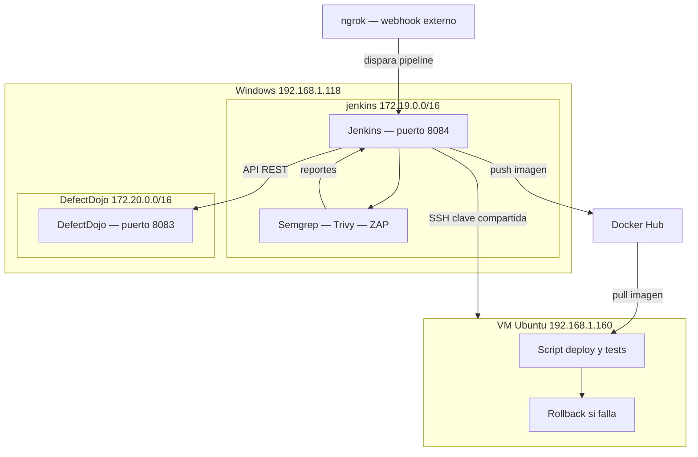

# Arquitectura del laboratorio DevSecOps

---

## Diagrama general



---

## Flujo del pipeline

**1. ngrok** recibe el webhook de GitHub y lo reenvía a Jenkins. El pipeline arranca.

**2. Jenkins ejecuta los escaners** dentro de su propio contenedor — Semgrep (SAST), Trivy (SCA + Image Scan) y ZAP (DAST). Todas las herramientas están instaladas en la imagen.

**3. Jenkins hace push de la imagen a Docker Hub** usando las credenciales de Docker Hub guardadas en su gestor de secretos.

**4. Jenkins envía todos los reportes a DefectDojo** via API REST por la red interna `modulo5diplomado`.

**5. Jenkins se conecta por SSH a la VM Ubuntu** usando la clave compartida en la carpeta por defecto. En la VM corre el script que jala la imagen de Docker Hub, levanta la app, verifica que todo esté corriendo y ejecuta rollback si algo falla.

---

## SSH — cómo funciona la clave compartida

No está guardada en las credenciales de Jenkins. La clave se ubica en la carpeta por defecto que SSH reconoce en ambos lados — `~/.ssh/`. Jenkins la usa desde ahí directamente para autenticarse en la VM sin contraseña.

---

## Por qué la ruta estática en Windows

Jenkins vive en la red Docker `172.19.0.0/16`. La VM Ubuntu tiene IP `192.168.1.160`, red física. Por defecto el contenedor no sabe cómo llegar ahí.

```cmd
route add -p 192.168.1.0 mask 255.255.255.0 172.19.0.1
```

```
Jenkins 172.19.0.2 → gateway 172.19.0.1 → Windows → VM 192.168.1.160
```

El `-p` lo hace permanente. Sin él desaparece al reiniciar Windows.

Verificar que existe:

```cmd
route print | findstr 192.168.1
```

---

## Por qué la red `modulo5diplomado`

Al hacer `docker compose up` cada proyecto crea su propia red automáticamente. Jenkins nace en `jenkinsysemgrep_default` y DefectDojo en `django-defectdojo_default` — redes distintas que no se ven entre sí aunque estén en el mismo host.

Para que Jenkins pueda enviar los reportes a DefectDojo se crea una red puente y se conectan ambos contenedores a ella:

```cmd
docker network create modulo5diplomado
docker network connect modulo5diplomado jenkins-devsecops
docker network connect modulo5diplomado django-defectdojo-nginx-1
```

---

## Contenedores corriendo

| Contenedor                         | Puerto         | Red                                              |
| ---------------------------------- | -------------- | ------------------------------------------------ |
| `jenkins-devsecops`                | `8084`         | `jenkinsysemgrep_default` + `modulo5diplomado`   |
| `django-defectdojo-nginx-1`        | `8083`         | `django-defectdojo_default` + `modulo5diplomado` |
| `django-defectdojo-uwsgi-1`        | —              | `django-defectdojo_default`                      |
| `django-defectdojo-celeryworker-1` | —              | `django-defectdojo_default`                      |
| `django-defectdojo-celerybeat-1`   | —              | `django-defectdojo_default`                      |
| `django-defectdojo-postgres-1`     | `5432` interno | `django-defectdojo_default`                      |
| `django-defectdojo-valkey-1`       | `6379` interno | `django-defectdojo_default`                      |

---

## Comandos útiles

```cmd
:: Ver contenedores corriendo
docker ps

:: Ver redes
docker network ls

:: Inspeccionar la red puente
docker network inspect modulo5diplomado

:: Verificar ruta estática a la VM
route print | findstr 192.168.1

:: Entrar al contenedor Jenkins
docker exec -it jenkins-devsecops bash

:: Logs Jenkins
docker logs jenkins-devsecops
```
