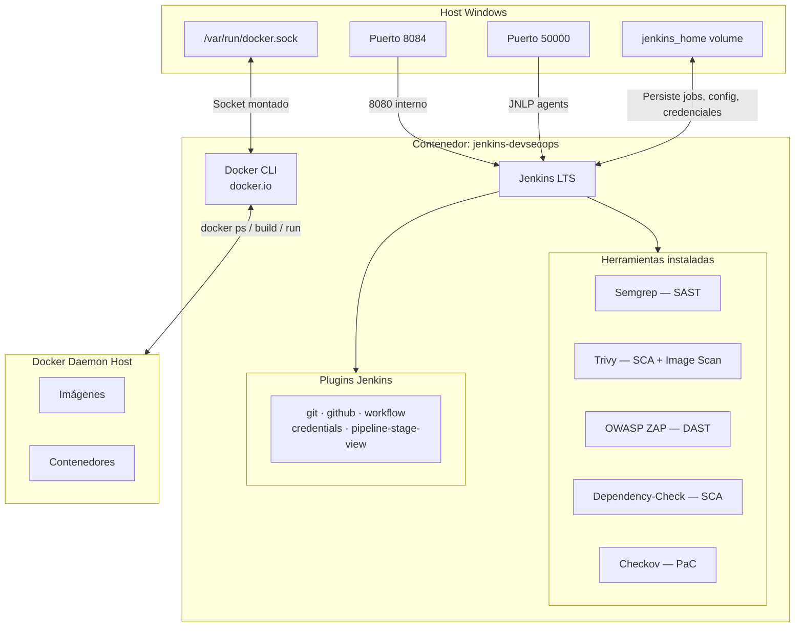

# Jenkins DevSecOps — Arquitectura del contenedor

---

## Diagrama de arquitectura



---

## Dockerfile — explicación por bloque

### Base

```dockerfile
FROM jenkins/jenkins:lts
USER root
```

**`FROM jenkins/jenkins:lts`** — define la imagen base del contenedor. En lugar de partir de un sistema operativo vacío, se parte de la imagen oficial de Jenkins ya configurada. La etiqueta `lts` (_Long Term Support_) indica que es la versión estable con soporte extendido — no la más nueva, sino la más probada y mantenida.

**`USER root`** — por defecto la imagen de Jenkins corre con un usuario sin privilegios llamado `jenkins`. Para instalar paquetes del sistema operativo se necesitan permisos de administrador. Este comando cambia al usuario `root` para todos los `RUN` siguientes. Al final del Dockerfile se vuelve a `USER jenkins` para que el proceso de Jenkins no corra con privilegios innecesarios.

---

### RUN 1 — Dependencias base del sistema

```dockerfile
RUN apt-get update && apt-get install -y \
    curl wget unzip git \
    python3 python3-pip \
    maven \
    docker.io \
    && apt-get clean && rm -rf /var/lib/apt/lists/*
```

**`apt-get update`** — refresca el índice de paquetes disponibles del sistema Debian que usa la imagen base. Sin esto `apt-get install` trabajaría con un índice desactualizado y podría no encontrar los paquetes o instalar versiones viejas.

**`apt-get install -y`** — instala los paquetes listados. El flag `-y` responde automáticamente "sí" a las confirmaciones que apt haría interactivamente — necesario porque durante el build de Docker no hay nadie para escribir `y` en el teclado.

**`curl` / `wget`** — herramientas para hacer descargas HTTP desde la línea de comandos. Los siguientes bloques `RUN` las usan para descargar los binarios de Trivy, ZAP y Dependency-Check desde GitHub.

**`unzip`** — descompresor de archivos `.zip`. Dependency-Check se distribuye como `.zip` y se necesita esta herramienta para extraerlo.

**`git`** — cliente Git. Jenkins necesita clonar el repositorio de la aplicación en el stage de Checkout del pipeline.

**`python3` / `python3-pip`** — intérprete de Python y su gestor de paquetes. Semgrep y Checkov son herramientas Python que se instalan via `pip3` en los bloques siguientes.

**`maven`** — herramienta de build para proyectos Java. El pipeline lo usa en el stage de Build Maven para compilar el proyecto y generar el `.jar`.

**`docker.io`** — instala el Docker CLI dentro del contenedor. Es solo el cliente, no el Daemon. Permite ejecutar comandos como `docker build`, `docker run`, `docker ps` desde dentro del contenedor Jenkins. Esos comandos se comunican con el Docker Daemon del host a través del socket montado — explicado más abajo.

**`apt-get clean && rm -rf /var/lib/apt/lists/*`** — limpia la caché de paquetes que `apt` dejó en disco durante la instalación. No se necesita después del build y eliminarla reduce el tamaño final de la imagen.

---

### RUN 2 — SAST: Semgrep

```dockerfile
RUN pip3 install semgrep --break-system-packages
```

**`pip3 install semgrep`** — descarga e instala Semgrep desde PyPI (Python Package Index), el repositorio oficial de paquetes Python. Semgrep es la herramienta de análisis estático de código (SAST) del pipeline — lee el código fuente sin ejecutarlo y busca patrones que coincidan con reglas de vulnerabilidades conocidas: inyecciones, credenciales hardcodeadas, uso inseguro de APIs, entre otros.

**`--break-system-packages`** — en versiones modernas de Debian/Ubuntu, el sistema operativo protege su entorno Python para evitar que instalaciones de `pip` rompan paquetes del sistema. Este flag le dice explícitamente a pip que se permite instalar aunque afecte al entorno del sistema. Es necesario porque dentro del contenedor no hay un entorno virtual separado.

---

### RUN 3 — SCA + Image Scan: Trivy

```dockerfile
RUN curl -sfL https://raw.githubusercontent.com/aquasecurity/trivy/main/contrib/install.sh \
    | sh -s -- -b /usr/local/bin
```

**`curl -sfL`** — descarga el script de instalación oficial de Trivy desde el repositorio de Aqua Security en GitHub. Los flags significan: `-s` silencia la barra de progreso, `-f` falla silenciosamente si hay un error HTTP, `-L` sigue redirecciones.

**`| sh -s -- -b /usr/local/bin`** — el pipe pasa el script descargado directamente al intérprete `sh` para ejecutarlo. `-s` le indica a `sh` que lea el script desde stdin. `--` separa los flags de `sh` de los argumentos del script. `-b /usr/local/bin` es un argumento del propio script de instalación que le dice dónde colocar el binario `trivy` — en `/usr/local/bin` para que esté disponible como comando global.

Trivy cumple dos roles en el pipeline: como **SCA** escanea el `pom.xml` buscando dependencias con CVEs, y como **Image Checker** analiza el `Dockerfile` y la imagen construida buscando misconfigurations y paquetes del sistema base vulnerables.

---

### RUN 4 — SCA: OWASP Dependency-Check

```dockerfile
RUN curl -sL \
    "https://github.com/jeremylong/DependencyCheck/releases/download/v10.0.4/dependency-check-10.0.4-release.zip" \
    -o /tmp/depcheck.zip \
    && unzip /tmp/depcheck.zip -d /opt/ \
    && rm /tmp/depcheck.zip \
    && ln -s /opt/dependency-check/bin/dependency-check.sh /usr/local/bin/dependency-check
```

**`curl -sL "..." -o /tmp/depcheck.zip`** — descarga el archivo `.zip` de la versión `10.0.4` de Dependency-Check desde GitHub Releases y lo guarda en `/tmp/depcheck.zip`. `-o` especifica el archivo de destino en lugar de imprimir el contenido en pantalla.

**`unzip /tmp/depcheck.zip -d /opt/`** — extrae el contenido del zip en la carpeta `/opt/`. El resultado es la carpeta `/opt/dependency-check/` con todos los archivos de la herramienta adentro.

**`rm /tmp/depcheck.zip`** — elimina el zip después de extraerlo. Ya no se necesita y ocupa espacio en la imagen.

**`ln -s /opt/dependency-check/bin/dependency-check.sh /usr/local/bin/dependency-check`** — crea un symlink (enlace simbólico) en `/usr/local/bin/dependency-check` que apunta al script real en `/opt/`. Esto permite llamar al comando como `dependency-check` desde cualquier lugar, sin escribir la ruta completa cada vez.

Dependency-Check es un segundo escáner SCA complementario a Trivy. Consulta la base de datos NVD (National Vulnerability Database) del NIST para detectar CVEs en las dependencias del proyecto.

---

### RUN 5 — DAST: OWASP ZAP

```dockerfile
RUN curl -L \
    "https://github.com/zaproxy/zaproxy/releases/download/v2.16.1/ZAP_2.16.1_Linux.tar.gz" \
    -o /tmp/zap.tar.gz \
    && tar -xzf /tmp/zap.tar.gz -C /opt/ \
    && mv /opt/ZAP_2.16.1 /opt/zap \
    && rm /tmp/zap.tar.gz \
    && ln -s /opt/zap/zap.sh /usr/local/bin/zap.sh
```

**`curl -L "..." -o /tmp/zap.tar.gz`** — descarga el archivo comprimido `.tar.gz` de ZAP versión `2.16.1` desde GitHub Releases. `-L` sigue redirecciones HTTP que GitHub usa para servir los releases.

**`tar -xzf /tmp/zap.tar.gz -C /opt/`** — extrae el archivo comprimido. `-x` extrae, `-z` descomprime gzip, `-f` indica el archivo fuente, `-C /opt/` define el directorio de destino. El resultado es la carpeta `/opt/ZAP_2.16.1/`.

**`mv /opt/ZAP_2.16.1 /opt/zap`** — renombra la carpeta a un nombre fijo `/opt/zap` sin número de versión. Así si en el futuro se actualiza ZAP, solo cambia la URL de descarga y el `mv`, sin tocar el symlink.

**`rm /tmp/zap.tar.gz`** — elimina el archivo comprimido para no inflar la imagen.

**`ln -s /opt/zap/zap.sh /usr/local/bin/zap.sh`** — crea el symlink para poder invocar ZAP con `zap.sh` desde cualquier directorio del pipeline.

ZAP es la herramienta de análisis dinámico (DAST). A diferencia de Semgrep que analiza código estático, ZAP ataca la aplicación mientras está corriendo, simulando un atacante externo. Busca XSS, SQL Injection, headers inseguros, endpoints expuestos, entre otros.

---

### RUN 6 — PaC: Checkov

```dockerfile
RUN pip3 install checkov --break-system-packages
```

**`pip3 install checkov`** — descarga e instala Checkov desde PyPI. Checkov es la herramienta de Policy as Code (PaC) del pipeline — analiza archivos de infraestructura como código buscando configuraciones inseguras antes de que lleguen a producción.

Checkov entiende múltiples formatos: `Dockerfile`, `docker-compose.yml`, Terraform, Kubernetes YAML, Helm charts, entre otros. En el pipeline analiza el `Dockerfile` y el `docker-compose.yml` del proyecto buscando problemas como: contenedor corriendo como root, imagen base sin versión fija, puertos innecesarios expuestos, ausencia de límites de recursos, secretos hardcodeados en variables de entorno.

**`--break-system-packages`** — misma razón que en Semgrep: necesario para instalar paquetes Python en el entorno del sistema dentro del contenedor sin entorno virtual.

Checkov se instala en `~/.local/bin/checkov` del usuario actual (root durante el build). Por eso en el pipeline se referencia con la variable `CHECKOV_BIN=/var/jenkins_home/.local/bin/checkov` — cuando Jenkins corre como usuario `jenkins`, esa es la ruta donde quedó instalado.

---

### USER jenkins — volver al usuario sin privilegios

```dockerfile
USER jenkins
```

Devuelve el usuario activo a `jenkins` para todos los comandos posteriores. Los plugins de Jenkins se instalan ya con este usuario. Más importante, cuando el contenedor arranca y Jenkins comienza a correr pipelines, lo hace sin privilegios de root — principio de mínimo privilegio. Si un pipeline malicioso intentara hacer algo dañino al sistema del contenedor, el usuario `jenkins` no tendría permisos para hacerlo.

---

### RUN 7 — Plugins Jenkins

```dockerfile
RUN jenkins-plugin-cli --plugins \
    git \
    github \
    workflow-aggregator \
    credentials-binding \
    pipeline-stage-view
```

**`jenkins-plugin-cli`** — herramienta incluida en la imagen base de Jenkins para instalar plugins durante el build. Descarga los plugins desde el Update Center oficial de Jenkins.

**`git`** — permite a Jenkins ejecutar operaciones Git dentro de los pipelines: clonar repositorios, hacer checkout de ramas, leer el historial de commits.

**`github`** — integración con la API de GitHub. Recibe webhooks cuando hay un push al repositorio y dispara el pipeline automáticamente.

**`workflow-aggregator`** — habilita la sintaxis declarativa del `Jenkinsfile` (Pipeline as Code). Sin este plugin Jenkins no entendería los bloques `pipeline { }`, `stages { }`, `steps { }`.

**`credentials-binding`** — permite inyectar secretos almacenados en Jenkins (tokens de API, contraseñas, claves SSH) como variables de entorno en el pipeline, sin que aparezcan en los logs ni en el código.

**`pipeline-stage-view`** — agrega una vista visual en la UI de Jenkins que muestra el estado de cada stage del pipeline como un tablero, con tiempos de ejecución y resultado de cada etapa.

---

## Por qué el socket `/var/run/docker.sock`

```yaml
volumes:
  - /var/run/docker.sock:/var/run/docker.sock
```

El socket de Docker es el canal de comunicación entre el Docker CLI y el Docker Daemon. Es un archivo especial de tipo socket Unix que el Daemon escucha esperando instrucciones.

Al montar el socket del host dentro del contenedor, el Docker CLI instalado en la imagen (`docker.io`) se conecta directamente al Docker Daemon del host en lugar de buscar uno propio dentro del contenedor — que no existe. Esto se llama Docker-out-of-Docker (DooD).

El resultado es que desde una etapa del Jenkinsfile se puede ejecutar:

```sh
docker build -t mi-app .
docker run mi-app
docker ps
trivy image mi-app
```

Y esos comandos actúan sobre el Docker del host — no levantan un Docker separado dentro del contenedor. Por eso al hacer `docker ps` desde Jenkins se ven los mismos contenedores que en el host.

---

## Por qué el volumen `jenkins_home`

```yaml
volumes:
  - jenkins_home:/var/jenkins_home
```

Jenkins guarda en `/var/jenkins_home` todo lo que importa: jobs configurados, historial de builds, credenciales, plugins instalados y configuración del servidor. Sin un volumen, esos datos viven solo dentro del contenedor y se pierden cuando el contenedor se destruye.

Al mapearlo a un volumen nombrado de Docker, esos datos persisten en el host aunque el contenedor se destruya con `docker compose down`. Solo se pierden si se usa `docker compose down -v`, que elimina explícitamente los volúmenes.

---

## docker-compose.yml — explicación por bloque

```yaml
services:
  jenkins:
    build:
      context: .
      dockerfile: Dockerfile
```

**`build`** — en lugar de descargar una imagen de Docker Hub con `image:`, le dice a Docker Compose que construya la imagen localmente. **`context: .`** define la carpeta que Docker usa como raíz del build — el punto significa la carpeta actual, donde está el `Dockerfile` y todos los archivos que el build pueda necesitar copiar. **`dockerfile: Dockerfile`** especifica el nombre del archivo a usar — útil si hay varios Dockerfiles en el proyecto.

---

```yaml
container_name: jenkins-devsecops
```

Le da un nombre fijo al contenedor en lugar del nombre aleatorio que Docker asigna por defecto (`compose-jenkins-1`, por ejemplo). Esto permite referenciarlo directamente por nombre en cualquier comando:

```sh
docker exec jenkins-devsecops cat /var/jenkins_home/secrets/initialAdminPassword
docker logs jenkins-devsecops
docker restart jenkins-devsecops
```

---

```yaml
ports:
  - "8084:8080"
  - "50000:50000"
```

Mapea puertos del host hacia el contenedor en formato `host:contenedor`.

| Mapeo         | Por qué                                                                                                                                                                                             |
| ------------- | --------------------------------------------------------------------------------------------------------------------------------------------------------------------------------------------------- |
| `8084:8080`   | Jenkins corre internamente en el puerto `8080`. Se expone como `8084` en el host para no colisionar con otros servicios que ya usen el `8080` — como la propia app Spring Boot u otros contenedores |
| `50000:50000` | Puerto JNLP para conectar agentes Jenkins externos. Si se agregan nodos esclavos al cluster Jenkins, se comunican por este puerto                                                                   |

---

```yaml
volumes:
  - jenkins_home:/var/jenkins_home
  - /var/run/docker.sock:/var/run/docker.sock
```

Dos montajes con propósitos completamente distintos:

**`jenkins_home:/var/jenkins_home`** — volumen nombrado de Docker. Todo lo que Jenkins escribe en `/var/jenkins_home` queda guardado en un volumen gestionado por Docker en el host. El contenedor puede destruirse y recrearse sin perder jobs, builds ni credenciales.

**`/var/run/docker.sock:/var/run/docker.sock`** — no es un volumen de datos sino un socket Unix. Se monta el socket del Docker Daemon del host directamente dentro del contenedor. El Docker CLI instalado en la imagen usa ese socket para enviar comandos al Daemon del host. Sin este montaje, `docker build` o `docker run` desde dentro de Jenkins fallarían porque no habría ningún Daemon escuchando.

---

```yaml
restart: unless-stopped
```

Define la política de reinicio del contenedor ante distintos escenarios:

| Escenario                                        | Comportamiento                                        |
| ------------------------------------------------ | ----------------------------------------------------- |
| El contenedor crashea o falla                    | Docker lo reinicia automáticamente                    |
| Se reinicia el host o Docker Desktop             | Docker lo levanta solo al arrancar                    |
| Se detiene manualmente con `docker compose stop` | Docker no lo reinicia — respeta la parada intencional |

Es la política más práctica para servicios de infraestructura como Jenkins: siempre activo salvo que se decida apagarlo explícitamente.

---

```yaml
volumes:
  jenkins_home:
```

Declara el volumen nombrado `jenkins_home` a nivel de Docker Compose. Sin esta declaración en la sección `volumes:` raíz del archivo, la referencia `jenkins_home:/var/jenkins_home` dentro del servicio fallaría porque Docker Compose no sabría que ese volumen existe. Docker crea el volumen físico en el host la primera vez que se levanta el compose con `docker compose up`, y lo mantiene hasta que se elimina explícitamente con `docker volume rm jenkins_home` o `docker compose down -v`.
