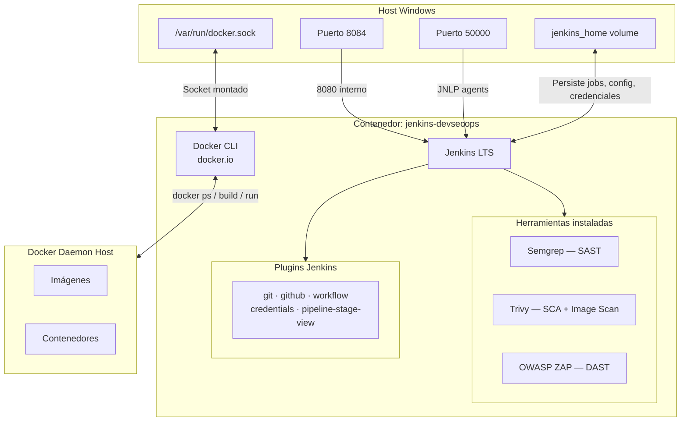

# Jenkins DevSecOps — Arquitectura del contenedor

---

## Diagrama de arquitectura



---

## Dockerfile — explicación por bloque

### Base

```dockerfile
FROM jenkins/jenkins:lts
USER root
```

Se parte de la imagen oficial de Jenkins en su versión LTS (Long Term Support).
Se cambia a `root` para poder instalar paquetes en el sistema operativo del contenedor.

---

### RUN 1 — Dependencias base del sistema

```dockerfile
RUN apt-get update && apt-get install -y \
    curl wget unzip git \
    python3 python3-pip \
    maven \
    docker.io \
    && apt-get clean && rm -rf /var/lib/apt/lists/*
```

Instala las herramientas base del sistema operativo (Debian/Ubuntu) dentro del contenedor:

| Paquete                   | Para qué se necesita                                                                                                                                   |
| ------------------------- | ------------------------------------------------------------------------------------------------------------------------------------------------------ |
| `curl` / `wget`           | Descargar binarios de herramientas de seguridad en los siguientes `RUN`                                                                                |
| `unzip`                   | Descomprimir el `.zip` de OWASP Dependency-Check                                                                                                       |
| `git`                     | Jenkins necesita clonar repositorios                                                                                                                   |
| `python3` / `python3-pip` | Requerido para instalar Semgrep via pip                                                                                                                |
| `maven`                   | Compilar proyectos Java dentro del pipeline                                                                                                            |
| `docker.io`               | **Instala el Docker CLI dentro del contenedor** — esto es lo que permite ejecutar `docker ps`, `docker build`, `docker run` desde una etapa de Jenkins |

> `apt-get clean && rm -rf /var/lib/apt/lists/*` limpia la caché de paquetes para reducir el tamaño final de la imagen.

---

### RUN 2 — SAST: Semgrep

```dockerfile
RUN pip3 install semgrep --break-system-packages
```

**Descarga desde:** PyPI (Python Package Index)

Semgrep es una herramienta de análisis estático de código (SAST). Analiza el código fuente **sin ejecutarlo**, buscando patrones de vulnerabilidades conocidas (inyecciones, credenciales hardcodeadas, uso inseguro de APIs, etc.) usando reglas definidas en YAML.

`--break-system-packages` es necesario en sistemas Debian modernos que protegen el entorno Python del sistema operativo.

---

### RUN 3 — SCA + Image Scan: Trivy

```dockerfile
RUN curl -sfL https://raw.githubusercontent.com/aquasecurity/trivy/main/contrib/install.sh \
    | sh -s -- -b /usr/local/bin
```

**Descarga desde:** GitHub Releases de `aquasecurity/trivy` vía script oficial

Trivy hace dos cosas en este pipeline:

- **SCA (Software Composition Analysis):** Escanea las dependencias del proyecto (pom.xml, package.json, etc.) buscando CVEs en librerías de terceros.
- **Image Scan:** Escanea la imagen Docker construida buscando vulnerabilidades en el sistema operativo base y en los paquetes instalados dentro de la imagen.

Se instala en `/usr/local/bin` para que esté disponible como comando global dentro del contenedor.

---

### RUN 4 — DAST: OWASP ZAP

```dockerfile
RUN curl -L \
    "https://github.com/zaproxy/zaproxy/releases/download/v2.16.1/ZAP_2.16.1_Linux.tar.gz" \
    -o /tmp/zap.tar.gz \
    && tar -xzf /tmp/zap.tar.gz -C /opt/ \
    && mv /opt/ZAP_2.16.1 /opt/zap \
    && rm /tmp/zap.tar.gz \
    && ln -s /opt/zap/zap.sh /usr/local/bin/zap.sh
```

**Descarga desde:** GitHub Releases de `zaproxy/zaproxy` — versión `2.16.1`

ZAP (Zed Attack Proxy) es la herramienta de análisis dinámico (DAST). A diferencia de Semgrep que analiza código estático, ZAP ataca la aplicación **mientras está corriendo**, simulando un atacante externo. Busca XSS, SQL Injection, headers inseguros, endpoints expuestos, etc.

Se descomprime en `/opt/zap` y se crea un symlink en `/usr/local/bin/zap.sh` para poder invocarlo directamente desde cualquier etapa del pipeline.

---

### RUN 5 — Plugins Jenkins

```dockerfile
RUN jenkins-plugin-cli --plugins \
    git \
    github \
    workflow-aggregator \
    credentials-binding \
    pipeline-stage-view
```

**Descarga desde:** Update Center oficial de Jenkins

| Plugin                | Para qué sirve                                                                                          |
| --------------------- | ------------------------------------------------------------------------------------------------------- |
| `git` + `github`      | Clonar repos y recibir webhooks de GitHub para disparar el pipeline                                     |
| `workflow-aggregator` | Habilita la sintaxis de `Jenkinsfile` (Pipeline as Code)                                                |
| `credentials-binding` | Inyectar secretos (tokens, contraseñas) como variables de entorno en el pipeline sin exponerlos en logs |
| `pipeline-stage-view` | Muestra visualmente en la UI de Jenkins el estado de cada etapa del pipeline                            |

---

## Por qué el socket `/var/run/docker.sock`

```yaml
volumes:
  - /var/run/docker.sock:/var/run/docker.sock
```

El socket de Docker es el canal de comunicación entre el Docker CLI y el Docker Daemon.
Al montar el socket del host dentro del contenedor, el Docker CLI instalado en la imagen (`docker.io`) se conecta directamente al Docker Daemon del host.

Esto significa que desde una etapa del Jenkinsfile puedes ejecutar:

```sh
docker build -t mi-app .
docker run mi-app
docker ps
trivy image mi-app
```

Y esos comandos actúan sobre el Docker del host — no levantan un Docker separado dentro del contenedor. Por eso ves `docker ps` mostrando los contenedores del host desde dentro de Jenkins.

---

## Por qué el volumen `jenkins_home`

```yaml
volumes:
  - jenkins_home:/var/jenkins_home
```

Jenkins guarda en `/var/jenkins_home` todo lo que importa: jobs configurados, historial de builds, credenciales, plugins instalados y configuración del servidor. Al mapearlo a un volumen nombrado de Docker, esos datos **persisten aunque el contenedor se destruya** con `docker compose down`. Solo se pierden si usas `docker compose down -v`.

---

## docker-compose.yml — explicación por bloque

```yaml
services:
  jenkins:
    build:
      context: .
      dockerfile: Dockerfile
```

No se descarga una imagen de Docker Hub. Se construye localmente desde el `Dockerfile` que está en la misma carpeta (`context: .`). Cada vez que hagas `docker compose build` se ejecutan todos los `RUN` del Dockerfile y se genera una imagen personalizada con Jenkins + todas las herramientas de seguridad ya instaladas.

---

```yaml
container_name: jenkins-devsecops
```

Le da un nombre fijo al contenedor en lugar del nombre aleatorio que Docker asigna por defecto. Esto permite referenciarlo directamente por nombre en comandos:

```sh
docker exec jenkins-devsecops cat /var/jenkins_home/secrets/initialAdminPassword
docker logs jenkins-devsecops
docker restart jenkins-devsecops
```

---

```yaml
ports:
  - "8084:8080"
  - "50000:50000"
```

Mapea puertos del host hacia el contenedor en formato `host:contenedor`.

| Mapeo         | Por qué                                                                                                                                            |
| ------------- | -------------------------------------------------------------------------------------------------------------------------------------------------- |
| `8084:8080`   | Jenkins corre en el puerto `8080` dentro del contenedor. Se expone como `8084` en el host para no chocar con otros servicios que ya usen el `8080` |
| `50000:50000` | Puerto JNLP para conectar agentes Jenkins externos. Si en algún momento se agregan nodos esclavos al cluster Jenkins, se comunican por este puerto |

---

```yaml
volumes:
  - jenkins_home:/var/jenkins_home
  - /var/run/docker.sock:/var/run/docker.sock
```

Dos montajes con propósitos completamente distintos:

**`jenkins_home:/var/jenkins_home`** — volumen nombrado de Docker. Todo lo que Jenkins escribe en `/var/jenkins_home` (jobs, builds, plugins, credenciales) queda guardado en un volumen gestionado por Docker en el host. El contenedor puede destruirse y recrearse sin perder nada.

**`/var/run/docker.sock:/var/run/docker.sock`** — no es un volumen de datos, es un socket Unix. Se monta el socket del Docker Daemon del host directamente dentro del contenedor. El Docker CLI instalado en la imagen (`docker.io`) usa ese socket para enviar comandos al Daemon del host. Sin este montaje, `docker build` o `docker ps` desde dentro de Jenkins fallarían porque no habría ningún Daemon escuchando.

---

```yaml
restart: unless-stopped
```

Le dice a Docker cómo comportarse si el contenedor se detiene:

| Escenario                                        | Comportamiento                                            |
| ------------------------------------------------ | --------------------------------------------------------- |
| El contenedor crashea o falla                    | Docker lo reinicia automáticamente                        |
| Se reinicia el host / Docker Desktop             | Docker lo levanta solo al arrancar                        |
| Se detiene manualmente con `docker compose stop` | Docker **no** lo reinicia — respeta la parada intencional |

Es la política más práctica para servicios de infraestructura como Jenkins: siempre activo salvo que tú decidas apagarlo.

---

```yaml
volumes:
  jenkins_home:
```

Declara el volumen nombrado `jenkins_home` a nivel de Docker Compose. Sin esta declaración, la referencia `jenkins_home:/var/jenkins_home` en el servicio fallaría. Docker crea el volumen la primera vez que se levanta el compose y lo mantiene hasta que se elimina explícitamente con `docker volume rm` o `docker compose down -v`.
